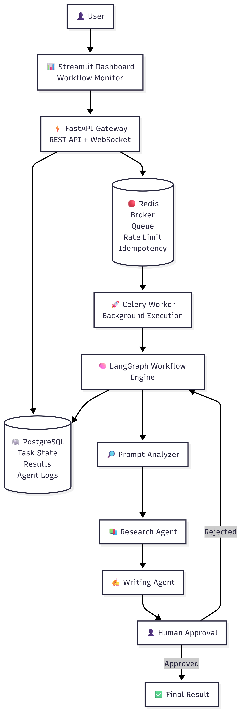
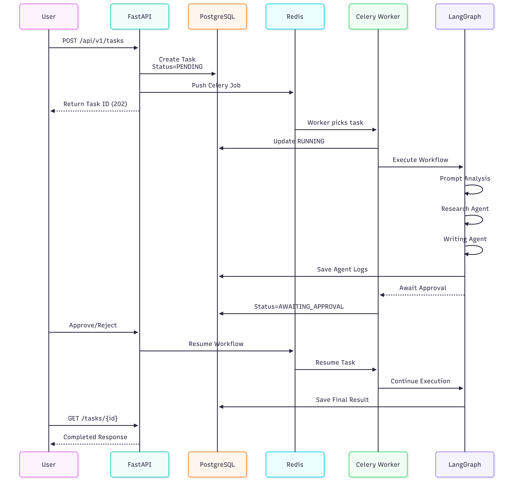
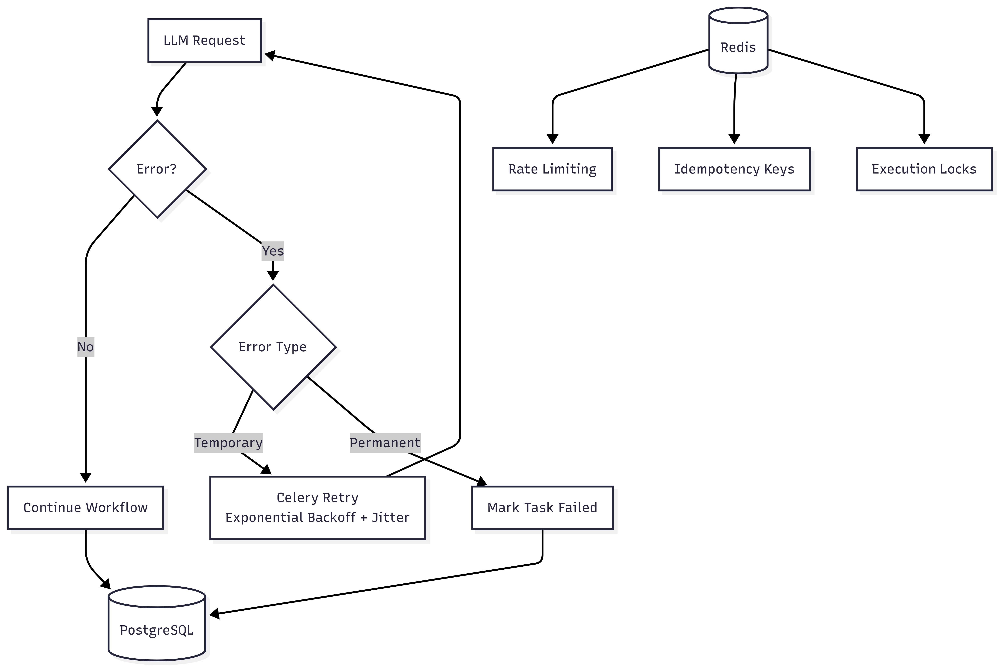

# Multi-Agent System Architecture

This document describes the current implementation of the asynchronous research-and-writing workflow. It is intentionally precise about which state is durable and which state is process-local.

## System Overview



## Complete Task Lifecycle



## State and Persistence

PostgreSQL is the durable system of record for the task prompt, status, result, timestamps, and JSON agent log. Redis is an operational store: it carries Celery messages and holds rate-limit counters, idempotency claims, duplicate-execution claims, and a task workspace with a 24-hour TTL.

LangGraph is compiled with `MemorySaver`. Its checkpoint data is therefore held in the worker process rather than persisted to PostgreSQL or Redis. The approval flow works while that process remains available, but a worker restart can lose the interrupted graph state even though the PostgreSQL task row remains. Durable checkpoint storage is a future production-hardening item.

## Failure and Recovery Behavior



1. The API creates a `PENDING` task, then queues `execute_workflow`.
2. The worker claims the task in Redis and sets `RUNNING`.
3. Transient workflow failures are retried up to three times with bounded exponential backoff and jitter. Configuration, authentication, and token-limit failures become `FAILED` without retry.
4. Celery late acknowledgements and worker-lost rejection reduce the chance of silently losing a delivery. The Redis execution claim prevents concurrent duplicate execution for the same task.
5. A draft produces `AWAITING_APPROVAL`. Approval queues `resume_workflow`; approval or rejection is then persisted as `COMPLETED` or `FAILED`.
6. LLM calls use a timeout and a process-local circuit breaker. Redis and database outages are not hidden by the health endpoint and should be monitored separately in production.

## Technology Stack

### Core Framework

- **FastAPI**: Async REST API
- **LangGraph**: Multi-agent workflow orchestration
- **Celery**: Async task queue
- **PostgreSQL**: Task persistence
- **Redis**: Celery broker/result backend, coordination controls, and temporary agent workspace

### AI/ML

- **LangChain**: LLM integration & tools
- **Groq/OpenAI**: LLM providers (configurable)

### Reliability and Operations

- **Tenacity**: Research-tool retries with exponential backoff
- **Structured logging**: JSON agent activity logs
- **Rate limiting and idempotency**: Redis-backed API controls
- **Circuit breaker and timeouts**: LLM failure containment

### Infrastructure

- **Docker Compose**: Service orchestration
- **WebSockets**: Real-time updates
- **Tenacity**: Retry logic

## Project Structure

```
src/
├── agents/
│   ├── state.py               # Flexible WorkflowState schema
│   ├── prompt_analyzer.py     # LLM-based prompt analysis
│   ├── research_agent.py      # Dynamic topic research
│   ├── writing_agent.py       # Template-based generation
│   ├── workflow.py            # LangGraph orchestration
│   └── tools.py               # Real LLM-based tools
├── api/
│   ├── main.py                # FastAPI app
│   ├── routes/tasks.py        # Task endpoints
│   └── websocket.py           # WebSocket manager
├── database/
│   ├── models.py              # SQLAlchemy models
│   ├── connection.py          # DB connection
│   └── crud.py                # Database operations
├── worker/
│   └── celery_app.py          # Celery worker & tasks
└── shared/
    ├── redis_client.py        # Redis workspace operations
    ├── logger.py              # Structured JSON logging
    └── llm_provider.py        # LLM factory (Groq/OpenAI)
scripts/
└── demo_client.py             # CLI script to test/verify end-to-end task workflow
```

## Key Design Decisions

### 1. Flexible State Schema

**Problem**: Hardcoded `research_langgraph` and `research_crewai` fields  
**Solution**: Generic `research_results: dict[str, Any]` supports any topics

### 2. LLM-Guided Analysis

**Problem**: Couldn't handle prompts outside hardcoded topics  
**Solution**: `PromptAnalyzer` uses LLM to extract topics from ANY prompt

### 3. Real Research Tools

**Problem**: Tools returned static, predetermined strings  
**Solution**: `llm_research` tool uses LLM to generate dynamic, real research

### 4. Template Engine

**Problem**: Only one hardcoded comparison template  
**Solution**: 4 templates (comparison, tutorial, analysis, summary) selected based on task type

### 5. Tool Registry

**Problem**: Research agent called specific, hardcoded tools  
**Solution**: Tool registry with dynamic selection based on configuration

## Capabilities: Before vs After

| Capability       | Before (Hardcoded)               | After (Generalized)                               |
| ---------------- | -------------------------------- | ------------------------------------------------- |
| **Topics**       | 2 only (LangGraph, CrewAI)       | ∞ (LLM extracts any)                              |
| **Task Types**   | Comparison only                  | 4 types (comparison, tutorial, analysis, summary) |
| **Tools**        | 2 mock tools with static strings | Registry of real LLM-based tools                  |
| **State**        | Hardcoded field names            | Flexible dict structure                           |
| **Prompts**      | 1 template                       | 4+ templates with dynamic selection               |
| **Research**     | Predetermined responses          | Real, variable content                            |
| **Adaptability** | One use case only                | General-purpose framework                         |

## Example Workflows

### Example 1: Comparison Task

```
Prompt: "Compare Redis vs PostgreSQL for caching"
  ↓
Analyzer extracts: topics=["Redis", "PostgreSQL"], type="comparison"
  ↓
Research Agent researches each topic with llm_research
  ↓
Writing Agent selects COMPARISON_TEMPLATE
  ↓
LLM generates comparison summary
  ↓
Human approves → Result saved
```

### Example 2: Tutorial Task

```
Prompt: "Create a Docker setup tutorial for beginners"
  ↓
Analyzer extracts: topics=["Docker"], type="tutorial"
  ↓
Research Agent researches Docker
  ↓
Writing Agent selects TUTORIAL_TEMPLATE
  ↓
LLM generates step-by-step tutorial
  ↓
Human approves → Result saved
```

## Production Readiness

### Implemented

- Flexible, general-purpose architecture
- Real research tools (not mocks)
- Dynamic prompt analysis
- Multiple task type support
- Comprehensive error handling
- Retry logic at multiple levels
- Structured logging
- WebSocket real-time updates
- Async task processing
- Human-in-the-loop workflow

### Known Gaps and Future Roadmap

- Replace `MemorySaver` with a shared durable LangGraph checkpointer.
- Add API authentication and authorization.
- Replace process-local metrics and circuit-breaker state with shared production observability.
- Tool result caching and parallel research for independent topics.
- Additional search providers and source-aware evaluation.

---
